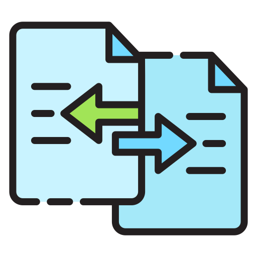

# FileZap

<p align="center">
  
</p>

<p align="center">
  <strong>Blazingly Fast Cross-Platform File Sharing Tool</strong>
</p>

<p align="center">
  <a href="#installation">Installation</a> •
  <a href="#quick-start">Quick Start</a> •
  <a href="#features">Features</a> •
  <a href="#architecture">Architecture</a> •
  <a href="#troubleshooting">Troubleshooting</a>
</p>

---

## Overview

FileZap is a lightning-fast, secure file sharing tool designed to simplify sharing files across devices and networks. Whether you're transferring files between machines on a local network or sharing with colleagues across the globe, FileZap provides an intuitive CLI and context-menu integration for seamless transfers.

## Features

- **🚀 Blazingly Fast**: Direct WebSocket transfers at maximum network speeds
- **🔒 Secure Sharing**: Optional password protection for sensitive files
- **🌐 Global Access**: Automatic tunnel creation for sharing beyond local networks
- **📱 Mobile Friendly**: QR codes for easy mobile access
- **🖥️ Context Menu Integration**: Right-click to share from Windows Explorer, macOS Finder, or Linux file managers
- **📋 Command-line Interface**: Powerful CLI with intuitive commands
- **🔄 No Registration Required**: Instant sharing without accounts or sign-ups
- **📊 Status Dashboard**: Real-time transfer monitoring via web interface

---

## Installation

FileZap can be installed on Windows, macOS, and Linux platforms using multiple methods.

### Prerequisites

- Node.js v14.0.0 or later
- npm v6.0.0 or later

### Method 1: Global NPM Installation

The recommended method for most users is to install FileZap globally via npm:

```bash
npm install -g filezap
```

Verify installation worked by running:

```bash
filezap --version
```

### Method 2: Local Installation

If you prefer to install FileZap as a project dependency:

```bash
# Create a new directory
mkdir my-filezap
cd my-filezap

# Initialize npm project
npm init -y

# Install FileZap locally
npm install filezap

# Run using npx
npx filezap
```

### Method 3: Manual Installation from Source

For developers or users who want the latest features:

```bash
# Clone the repository
git clone https://github.com/yourname/filezap.git
cd filezap

# Install dependencies
npm install

# Link the package globally
npm link

# Now you can use FileZap from anywhere
filezap --version
```

### Platform Specific Setup

#### Windows Setup

1. Launch command prompt or PowerShell as Administrator
2. Install FileZap globally:
   ```powershell
   npm install -g filezap
   ```
3. Enable context menu integration:
   ```powershell
   filezap integrate
   ```
4. If you encounter any permission errors, ensure you're running as Administrator

#### macOS Setup

1. Open Terminal
2. Install FileZap globally:
   ```bash
   npm install -g filezap
   ```
3. You may need to provide additional permissions:
   ```bash
   sudo chmod -R 755 $(npm root -g)/filezap
   ```
4. Enable Finder integration:
   ```bash
   filezap integrate
   ```
5. For macOS Catalina and later, you may need to grant full disk access to Terminal

#### Linux Setup

1. Open your terminal
2. Install FileZap globally:
   ```bash
   npm install -g filezap
   ```
3. Enable file manager integration:
   ```bash
   filezap integrate
   ```
4. For Debian/Ubuntu systems, you may need:
   ```bash
   sudo apt-get install xdg-utils
   ```

### Setting Up Global Sharing (Optional)

For sharing outside your local network, FileZap uses tunneling services:

1. Check tunnel status:
   ```bash
   filezap tunnels
   ```
2. If you encounter issues:
   ```bash
   filezap ngrok-diagnose
   filezap ngrok-fix
   ```

### Verifying Installation

After installation, run a simple diagnostic check:

```bash
filezap
```

You should see information about your system and available commands.

---

## Quick Start

### Sharing a File

**Method 1: Command Line**
```bash
filezap send /path/to/yourfile.pdf
```

**Method 2: Context Menu**
Right-click any file → Select "Share via FileZap"

**Method 3: Keyboard Shortcut**
In terminal, press `Ctrl+S` or `Alt+S` and select a file

### Receiving a File

**Method 1: Use the provided URL**
Open the URL provided by the sender in your browser

**Method 2: Command Line (Local Network)**
```bash
filezap receive 192.168.1.100 55555 filename.pdf
```

**Method 3: Command Line (Global URL)**
```bash
filezap get https://shortened-url.com filename.pdf
```

---

## Architecture

FileZap employs a sophisticated architecture designed for speed, security, and ease of use. This section details the technical underpinnings of the application.

### System Architecture Overview

FileZap operates on a hybrid peer-to-peer model with the following components:

```
┌─────────────────┐     ┌─────────────────┐     ┌─────────────────┐
│                 │     │                 │     │                 │
│  Sender Device  │◄────┤  Tunnel Server  │────►│ Receiver Device │
│                 │     │    (Optional)   │     │                 │
└────────┬────────┘     └─────────────────┘     └────────┬────────┘
         │                                               │
         │                                               │
         ▼                                               ▼
┌─────────────────┐                             ┌─────────────────┐
│  Local Server   │                             │  Web Browser/   │
│  (WebSockets)   │◄───────Direct Connection───►│  CLI Client     │
└─────────────────┘                             └─────────────────┘
```

### Key Components

1. **Command-Line Interface (CLI)**
   - Built with Commander.js
   - Manages user interactions and command processing
   - Implements keyboard shortcuts through readline module

2. **File Server**
   - Implemented using native Node.js HTTP server and WebSocket server
   - Serves both web interface and handles WebSocket connections
   - Processes file transfers with binary WebSocket messages

3. **Tunnel Management**
   - Integrates with tunneling services (ngrok/Serveo)
   - Handles URL shortening via TinyURL API
   - Manages tunnel lifecycle and error recovery

4. **Shell Integration**
   - Platform-specific implementations for Windows/macOS/Linux
   - Windows: Registry modifications for context menu
   - macOS: Automator workflow creation
   - Linux: Nautilus scripts and desktop entries

5. **Web Interface**
   - Responsive HTML/CSS design
   - QR code generation for mobile access
   - Real-time status updates via polling

### Data Flow

1. **Initialization Phase**
   - Application starts, detects platform, and configures environment
   - Command parser interprets user intent
   - Server component initializes on available ports

2. **Connection Phase**
   - For local sharing: WebSocket server starts on random available port
   - For global sharing: Tunnel established to local port
   - Authentication layer activated if password protection enabled

3. **Transfer Phase**
   - Binary data transmitted via WebSocket protocol
   - Progress monitoring and speed calculation
   - Integrity verification upon completion

4. **Termination Phase**
   - Resources cleaned up (tunnels closed, ports released)
   - Transfer statistics logged
   - Success/failure notification delivered

### Security Model

FileZap implements several security measures:

1. **Password Protection**
   - Optional per-file password protection
   - Password never stored in logs or transmitted in clear text
   - Auto-generation of strong passwords when using secure mode

2. **Temporary Links**
   - All sharing sessions have a default 30-minute expiration
   - One-time tunnels created per session
   - Server automatically shuts down after timeout

3. **Local Storage**
   - Downloaded files stored in user-specific directories
   - Path traversal protection implemented
   - Automatic file renaming to prevent overwrites

### Network Architecture

FileZap optimizes network connectivity through:

1. **IP Address Prioritization**
   - Smart ranking of network interfaces to determine primary IP
   - Deprioritization of virtual adapters and Docker interfaces
   - Fallback mechanisms when preferred interfaces unavailable

2. **Port Management**
   - Dynamic port allocation to avoid conflicts
   - Separate ports for WebSocket and HTTP servers
   - Port availability checking before server initialization

3. **Browser Integration**
   - Platform-specific browser launching techniques
   - Multiple fallback mechanisms for browser opening
   - Multiple connection methods (direct URL, QR code, command line)

### File System Integration

The application interacts with the host file system through:

1. **Path Normalization**
   - Cross-platform path handling
   - Support for spaces, special characters, and Unicode in filenames
   - Handling of Windows-specific path issues (quotes, UNC paths)

2. **File Discovery**
   - File dialog integration for interactive selection
   - Drag-and-drop support via command-line argument processing
   - Context menu integration for right-click sharing

3. **File Storage**
   - Configurable download location (defaults to ~/.filezap/shared/username)
   - Automatic directory creation if not present
   - Collision detection and unique filename generation

### Troubleshooting & Diagnostics

FileZap includes comprehensive diagnostic capabilities:

1. **Logging System**
   - Debug logs with verbose option
   - Log rotation and management
   - Error categorization and reporting

2. **Tunnel Diagnostics**
   - Tunnel connection testing
   - Auto-repair for common tunnel issues
   - Alternative tunnel providers when primary fails

3. **Network Diagnostics**
   - IP detection verification
   - Connectivity testing
   - Port availability checking

---

## Troubleshooting

### Common Issues

**Issue: Browser doesn't open automatically**
- **Solution**: Copy the URL shown in the terminal and paste it manually into your browser
- **Fix**: Ensure your system allows applications to open browsers

**Issue: "Failed to install shell integration"**
- **Solution**: Run the application with administrator/root privileges
- **Fix**: `sudo filezap integrate` on macOS/Linux or run as Administrator on Windows

**Issue: "Cannot establish tunnel"**
- **Solution**: Check your internet connection and firewall settings
- **Diagnosis**: Run `filezap ngrok-diagnose` to identify issues
- **Fix**: Run `filezap ngrok-fix` to attempt automatic repair

**Issue: "File not found" when the file exists**
- **Solution**: Use simple paths without special characters
- **Fix**: Move file to a directory with a simpler path and try again

### Diagnostics

For more detailed diagnostics:

```bash
# Check tunnel status
filezap tunnels

# Run ngrok diagnostics
filezap ngrok-diagnose

# Fix common issues
filezap ngrok-fix

# See active connections
filezap list
```

---


## License

[MIT License](LICENSE)

---

<p align="center">
  Made with ❤️ by the VanshCodeWorks
</p>